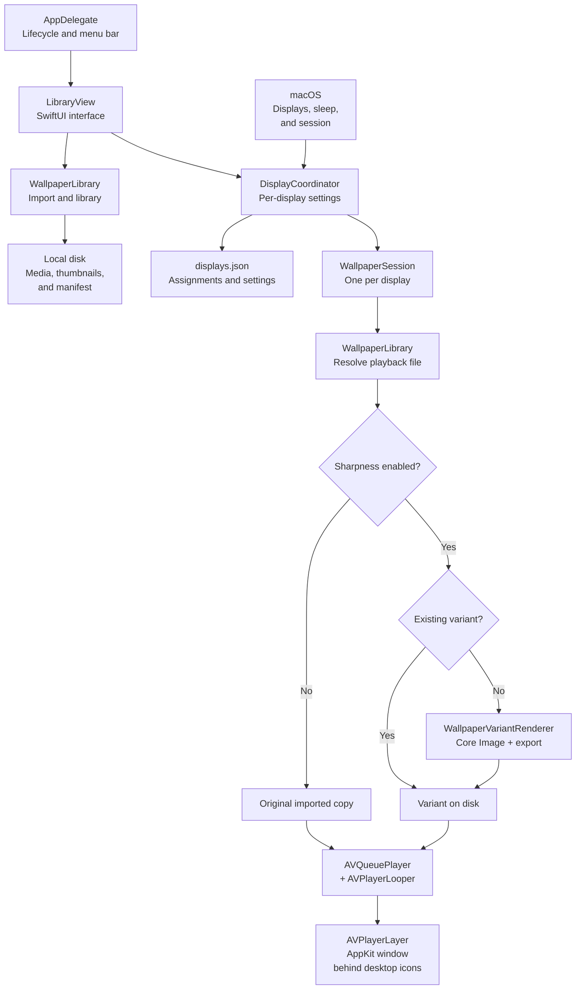

<p align="center"><strong>English</strong> · <a href="README.pt-BR.md">Português (Brasil)</a></p>

<p align="center">
  
</p>

<h1 align="center">Waypaper</h1>

<p align="center"><strong>Your desktop, in motion.</strong><br>
Turn your videos into animated wallpapers on macOS.<br>
A local library, per-display settings, and a native interface. No account, no cloud.</p>

<p align="center">macOS 13+ · Swift + SwiftUI · AVFoundation · No external dependencies</p>

<p align="center">
  <a href="#start-here">Start here</a> ·
  <a href="#the-app-in-action">Screenshots</a> ·
  <a href="#how-it-works">Architecture</a> ·
  <a href="#development">Development</a> ·
  <a href="#quick-answers">FAQ</a>
</p>


## What you can do

- **Bring your own videos.** Import using the button or drag files into the library.
- **Choose a wallpaper for each display.** Each independent screen has its own video, framing, pause state, and sharpness.
- **Preview before applying.** Static thumbnails and on-demand previews — the library does not play every video at once.
- **Adjust the look.** Fill the screen or preserve the full frame; add sharpness if you want.
- **Close the library and keep going.** The app stays in the menu bar while your wallpaper loops silently.
- **Restore your macOS background.** Click **Restaurar fundo** (Restore background) without deleting your library.

## Start here

### 1. Install the app

You need **macOS 13 or later**. Packages built by this project target **Apple Silicon — M1 and later**.

If you have a `Waypaper.dmg` or `Waypaper.zip`:

1. Open the DMG and drag **Waypaper.app** to **Applications**. For a ZIP, extract it and move the app to that folder.
2. Open **Waypaper** from Applications.
3. If macOS blocks it, go to **System Settings → Privacy & Security → Open Anyway** after attempting to open the app, and only if you trust the package's source.

> Packages use **ad hoc** signing, without Developer ID signing or notarization. Do not disable Gatekeeper. You do not need Swift, Python, or Xcode installed on the Mac running the packaged app.

**Only have the source code?** See [how to run it](#development) or [build a DMG/ZIP](#build-a-dmg-and-zip). The app does not include videos: use files you have the right to use.

### 2. Set your first wallpaper

The current app interface is in Brazilian Portuguese. The instructions below retain the actual button labels, with English explanations.

1. Click **Importar vídeos** (Import videos) or drag a video into the library.
2. Select the **display** in the left sidebar.
3. Click the video's thumbnail.
4. Optional: click **Reproduzir prévia** (Play preview) or press **Space** to preview the selected video.
5. Click **Aplicar ao monitor** (Apply to display).

That's it. You can close the library window; the video keeps playing on your desktop. To reopen the library, use the wave/W icon in the menu bar.

### 3. Make it yours

The controls under **Neste monitor** (On this display) affect the wallpaper applied to the selected screen.

| Control | What it does |
| --- | --- |
| **Preencher** (Fill) | Fills the screen; may crop the video's edges. |
| **Ajustar** (Fit) | Shows the entire video; may leave bars when the aspect ratios differ. |
| **Nitidez** (Sharpness) | Enhances edges in a processed copy of the video. Zero uses the original imported copy, without a filter. |
| **Pausar / Retomar** (Pause / Resume) | Controls playback on that display. |
| **Restaurar fundo** (Restore background) | Removes the video and reveals the original macOS wallpaper. |
| **Remover da biblioteca…** (Remove from library) | Deletes managed copies and clears display assignments. Does not delete your source file. |

## The app in action

<p align="center">
  
</p>

The screenshot at the top shows the real library: **displays on the left**, **videos in the center**, and **preview and settings on the right**. The GIF above uses the same interface captured by the smoke check, composited over a synthetic clip to suggest desktop playback.

### Preview before applying

<p align="center">
  
</p>

*A crop of the same screenshot, showing the preview and display application controls. The illustrated video is not included in the project.*

The preview is independent of the wallpaper: it starts only when requested and pauses when you hide, minimize, or close the library. It shows the imported video; the sharpness setting applies to desktop playback.

### Out of the way when you don't need the window

- **Library open:** Waypaper appears in the Dock and can be minimized normally.
- **Library closed:** it stays in the menu bar, without a Dock icon or Cmd-Tab entry.
- **Menu bar:** open the library, import videos, pause/resume all displays, or quit the app.

## Sharpness without a per-frame filter

Sharpness is optional and off by default. The first time you choose a level, Waypaper uses **Core Image (`CIUnsharpMask`)** to export a copy with the effect already applied. The interface shows **Preparando nitidez…** (Preparing sharpness) while processing.

The player then plays the resulting file normally, **without applying the filter in real time**. Returning to a previously prepared level reuses the existing copy.

| Situation | Behavior |
| --- | --- |
| Sharpness at zero | Plays the original imported copy. |
| New sharpness level | Processes and saves a variant before playing it. |
| Previously prepared level | Reuses the variant on disk. |
| Video removed from the library | Also removes its variants. |

**The tradeoff:** the initial preparation takes time, and variants use additional disk space. Values are grouped into **10 levels in 10% increments**, so nearby slider positions may use the same variant. Neither the source file nor the original imported copy is modified.

Sharpness is not AI super-resolution and may emphasize noise or halos. The variant is re-encoded; there is no promise of lossless export or resource usage identical to the original file. CPU, GPU, and memory usage depend on the video, hardware, and number of active displays.

## How it works

The interface manages the library; the coordinator determines what each display plays. Each independent screen gets a native playback session.



### Code responsibilities

| Directory | Responsibility |
| --- | --- |
| [`App/`](Sources/Waypaper/App/) | Entry point, lifecycle, window, menu, and integrated smoke check. |
| [`UI/`](Sources/Waypaper/UI/) | SwiftUI library and AVKit preview. |
| [`Library/`](Sources/Waypaper/Library/) | Validation, video copying, thumbnails, persistence, and sharpness variants. |
| [`Playback/`](Sources/Waypaper/Playback/) | Display identity, coordination, sessions, windows, and video layer. |
| [`Resources/`](Sources/Waypaper/Resources/) | Application icons. |
| [`scripts/`](scripts/) | Packaging, icons, demo GIF, and screen recording helpers. |

UI state and playback coordination use `@MainActor`. Video copying/analysis and thumbnail generation run outside the main actor. Imports are serialized and cancellable; they appear in the library only after successful persistence.

### Displays and power

- Assignments are saved by display identity. Disconnecting releases the playback session but preserves its settings for reconnection.
- Mirrored displays do not get a duplicate player for the mirror.
- Resolution or scaling changes update the window and Retina scale.
- Display sleep and session inactivity have separate playback gates; resuming does not override a manual pause.
- Playback pauses when macOS reports that the wallpaper window is fully occluded and resumes when it becomes visible again.
- With **Reduce Motion** enabled, the first wallpaper applied to a display starts paused.

There is no automatic battery policy, installed login item, remote catalog, or background service separate from the app. Each visible display plays its own video; multiple simultaneous 4K videos increase resource usage.

## Your files stay on your Mac

```text
~/Library/Application Support/Waypaper/
├── manifest.json    # library and metadata
├── displays.json    # wallpaper and settings for each display
├── media/           # copies of imported videos
├── thumbnails/      # static thumbnails
└── variants/        # sharpened copies, organized by video
```

Moving or deleting the source file after importing does not break the wallpaper: the app uses its own copy. Corrupt state files are reported rather than silently overwritten.

To update, quit Waypaper from its menu and replace the application. To uninstall, quit and remove the app; the library above remains on disk. Delete that folder only if you also want to discard imported videos and settings.

## Development

Requires macOS, Apple development tools, and **Swift 5.9 or later**. Run these commands from the repository root.

```sh
swift run Waypaper
```

To import a video and apply it directly to the first display in the list:

```sh
swift run Waypaper "/path/to/your-video.mp4"
```

Replace the path with an existing file. Each invocation with a file imports a new copy. If the legacy `videoPath` preference exists in the same preferences domain, it is imported once when the library is empty.

### Build a DMG and ZIP

With Python 3 and Apple tools installed:

```sh
python3 scripts/package.py
```

The script builds in **release mode for arm64**, bundles resources, signs the app ad hoc, and generates:

```text
dist/
├── Waypaper.app    # signed application bundle (for local testing)
├── Waypaper.dmg    # app + Applications shortcut
└── Waypaper.zip    # compressed application
```

Your library's videos are not included in the package. To distribute recent changes, regenerate the packages; a development build does not update an existing DMG.

### GitHub Releases

Pushing a version tag builds **Waypaper.dmg** and **Waypaper.zip** on GitHub Actions (Apple Silicon, macOS 13+) and attaches them to a [GitHub Release](../../releases). The bundle version comes from the tag (`v1.2.0` → `1.2.0`).

```sh
git tag v1.1.0
git push origin v1.1.0
```

Optional environment variables when packaging locally: `WAYPAPER_VERSION` (marketing version) and `WAYPAPER_BUILD` (build number written to `CFBundleVersion`).

### Demo GIF for the README

With ffmpeg and an active graphical session:

```sh
python3 scripts/render_demo.py
```

This runs the smoke check, captures the real library window, and writes `assets/images/waypaper-demo.gif` over a synthetic animated wallpaper clip. For a screen recording instead (requires Screen Recording permission for your terminal), use `./scripts/record_demo.sh`.

### Check the complete workflow

In an active graphical session, use a short video — the check waits for a complete loop, with a 90-second limit:

```sh
swift run Waypaper --smoke-test "/path/to/your-video.mp4"
```

The smoke check uses a **temporary library**, without changing your real library. It opens windows during execution, prints `PASS` for checks, and exits with code 1 on failure.

It covers imports, thumbnails, persistence, invalid inputs, corrupt manifests, cancellation, playback with real frames, pause, independent sessions, cached sharpness variants with the original preserved, looping, simulated reconnection, UI preview, and safe removal. It also saves a library screenshot to the temporary directory and prints its path in the terminal.

**Local validation limits:** checks have been exercised with a single physical display. Two sessions on that screen and simulated reconnection do not replace testing with two physical monitors, real hot-plugging, mirroring, Spaces/Mission Control, or actual locking/sleep. The smoke check does not measure fidelity, export frame rate, or resource usage; a UI screenshot does not prove the final desktop composition by WindowServer.

## Quick answers

**I closed the window. How do I reopen it?**  
Click the wave/W icon in the menu bar and open the library. Closing the window does not quit the app.

**The video is cropped or has bars.**  
Use **Ajustar** (Fit) to see the full frame or **Preencher** (Fill) to cover the screen. The difference comes from the video and display aspect ratios.

**Why does “Preparando nitidez…” appear?**  
The app is generating a copy with the filter applied. Wait for the export; this work is not repeated when you select an already prepared variant.

**Does the preview show the sharpness result?**  
No. The preview uses the imported video. Check the effect on the wallpaper applied to your display.

**Why is playback paused?**  
Check **Retomar** (Resume) under **Neste monitor** (On this display). Reduce Motion can make the first application start paused; sleep, session inactivity, and occlusion also interrupt playback automatically.

**Can I delete the original video after importing?**  
Waypaper already has its own copy. Keep your original if you want a backup; removing a video from the library does not delete its source file.

**My monitor reconnected without its wallpaper.**  
Select the display and apply the video again. Displays without a UUID or serial number use a transient identity and may need to be reassigned after reconnection or a restart.

**Which videos work?**  
Playback depends on the formats and codecs supported by AVFoundation on your macOS version. An MP4 with H.264 video is a starting point; importing validates that the file contains playable video with a finite duration. Audio is not played.

## Visual identity

The wave-shaped W uses the cyan, teal, and violet palette from the [aurora artwork](assets/images/waypaper-hero-aurora.png). The [icon master](assets/images/waypaper-app-icon-master.png) was generated with `image_gen` through the Codex CLI; the PNG/ICNS derivatives add transparency outside the rounded square. The menu bar icon is drawn natively and follows the system theme.

<details>
<summary>Regenerate the icons and view the visual prompt</summary>

```sh
python3 scripts/make_app_icon.py --mask-from assets/images/waypaper-app-icon-master.png
```

Prompt sent to Codex/imagegen, with the aurora artwork as a reference:

```text
Use the built-in imagegen skill and built-in image_gen tool only (NOT CLI fallback, NOT OPENAI_API_KEY). Generate exactly one macOS app icon master image.

Use case: logo-brand
Asset type: macOS app icon master (1024x1024 PNG)
Primary request: Simple stylized letter W formed by a smooth flowing wave ribbon; minimal geometric mark readable at 16px; no text labels, no wordmarks, no wallpaper scene
Input images: Image 1: reference for aurora teal/cyan/violet palette and soft glow mood only — do not copy the full hero composition
Style/medium: flat vector-like illustration, crisp edges, subtle inner glow
Composition/framing: centered mark on rounded-square app-icon canvas with comfortable padding; square 1:1
Lighting/mood: soft aurora glow on dark blue-violet background
Color palette: teal, cyan, violet accents on deep indigo base (inspired by reference)
Constraints: must read as W+wave at small sizes; no photographs; no UI chrome; no watermark
Avoid: busy wallpaper imagery, tiny illegible detail, text, dock mockups
```

</details>

---

Videos and build/distribution artifacts are ignored by Git. Screenshots show media used for demonstration; Waypaper does not grant rights to use or redistribute imported media.
