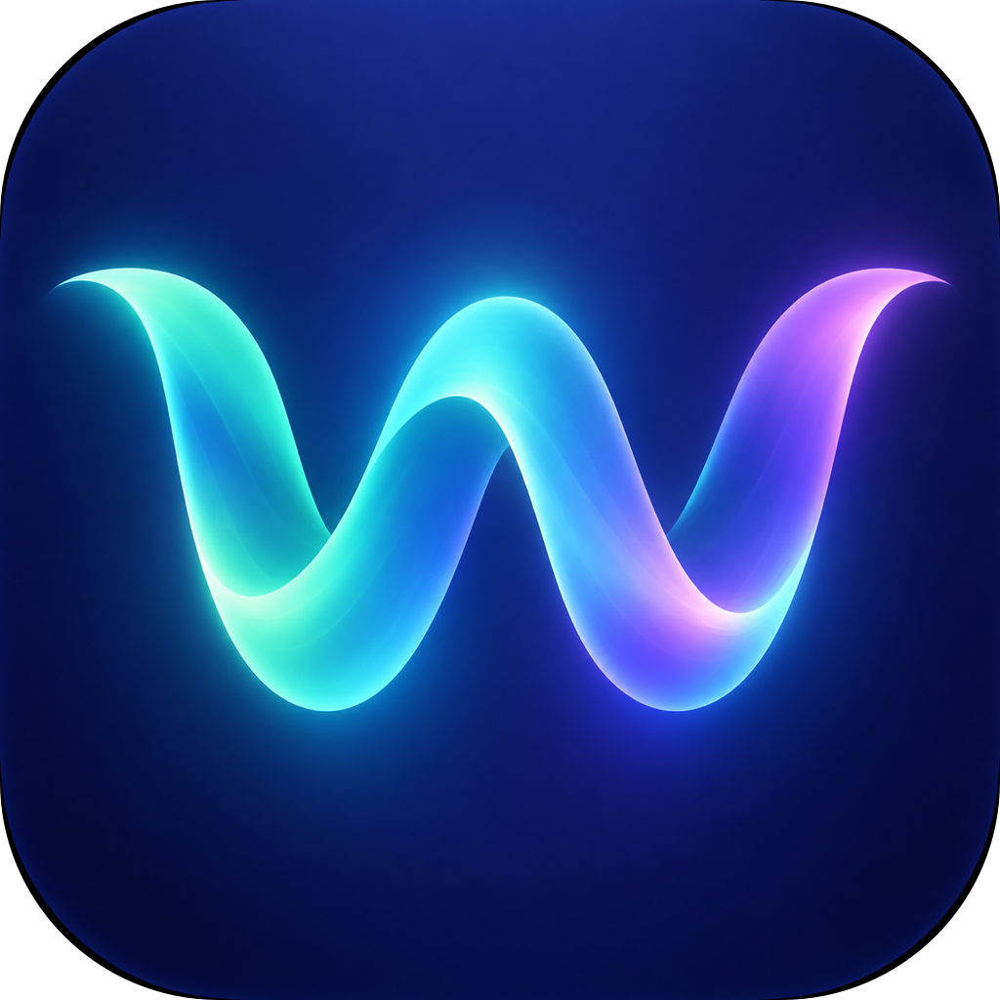
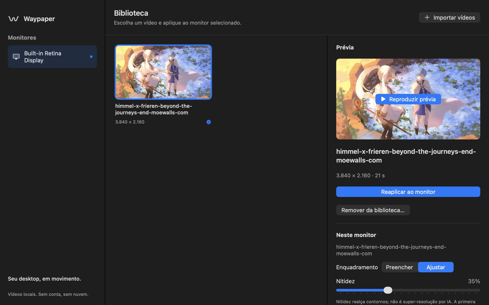
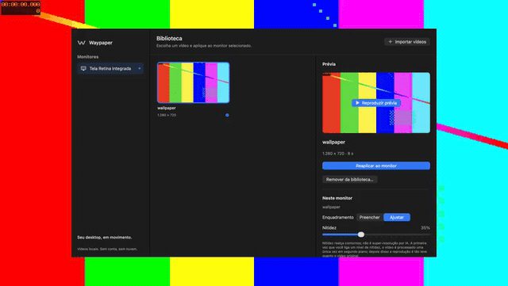
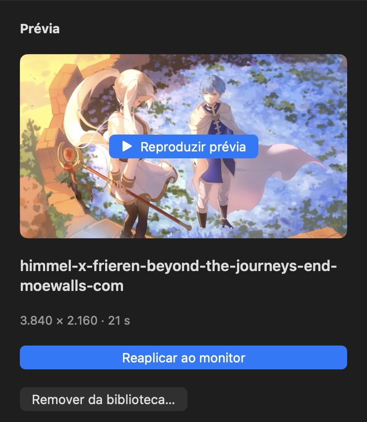
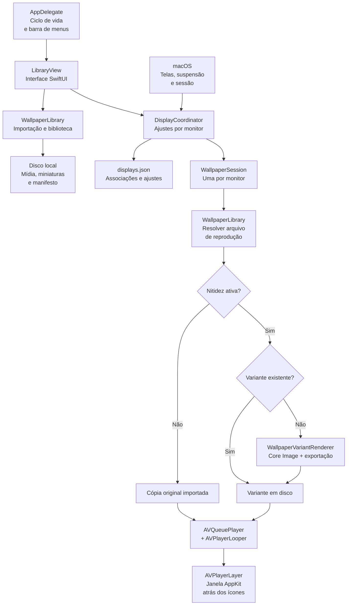

<p align="center"><a href="README.md">English</a> · <strong>Português (Brasil)</strong></p>

<p align="center">
  
</p>

<h1 align="center">Waypaper</h1>

<p align="center"><strong>Seu desktop, em movimento.</strong><br>
Transforme seus vídeos em wallpapers animados no macOS. Biblioteca local, ajustes por monitor e interface nativa. Sem conta, sem nuvem.</p>

<p align="center">
  <a href="https://github.com/marcioecom/waypaper/releases/latest/download/Waypaper.dmg"><strong>⬇ Baixar Waypaper.dmg</strong></a>
</p>

<p align="center"><sub>macOS 13 ou superior · Apple Silicon (M1 e posteriores) · Macs Intel não são suportados</sub></p>

<p align="center">
  <a href="#comece-aqui">Comece aqui</a> ·
  <a href="#o-app-na-prática">Capturas</a> ·
  <a href="#como-funciona">Arquitetura</a> ·
  <a href="#desenvolvimento">Desenvolvimento</a> ·
  <a href="#dúvidas-rápidas">Dúvidas</a>
</p>

## Primeira abertura

O download é assinado **ad hoc**. Não é notarizado. Não desative o Gatekeeper.

1. Abra o DMG e arraste **Waypaper** para **Aplicativos**.
2. Abra o **Waypaper**.
3. Se o macOS disser que não foi possível abrir, vá a **Ajustes do Sistema → Privacidade e Segurança** e clique em **Abrir Mesmo Assim**. Esse botão só aparece depois da tentativa bloqueada. Em seguida, confirme **Abrir**.



## O que você pode fazer

- **Usar seus próprios vídeos.** Importe pelo botão ou arraste arquivos para a biblioteca.
- **Escolher um wallpaper por monitor.** Cada tela independente tem seu próprio vídeo, enquadramento, pausa e nitidez.
- **Conferir antes de aplicar.** Miniaturas estáticas e prévia sob demanda — a biblioteca não reproduz todos os vídeos ao mesmo tempo.
- **Ajustar o visual.** Preencha a tela ou preserve o quadro inteiro; adicione nitidez se quiser.
- **Fechar a biblioteca e continuar usando.** O app fica na barra de menus e o wallpaper continua em loop, sem áudio.
- **Abrir ao iniciar a sessão.** Ative **Abrir ao iniciar a sessão** na lateral da biblioteca (também na barra de menus). Fica desligado até você ativar, e usa o item de início de sessão do macOS 13 deste app — não um serviço separado.
- **Voltar ao fundo do macOS.** Um clique em **Restaurar fundo**, sem apagar sua biblioteca.

## Comece aqui

### 1. Instale o aplicativo

Você precisa de **macOS 13 ou superior** em **Apple Silicon (M1 e posteriores)**. Estes pacotes não são universais e não rodam em Macs Intel.

[⬇ Baixar Waypaper.dmg](https://github.com/marcioecom/waypaper/releases/latest/download/Waypaper.dmg) ou use o `Waypaper.zip` da mesma release.

1. Abra o DMG e arraste **Waypaper.app** para **Aplicativos**. Se for ZIP, descompacte e mova o app para essa pasta.
2. Abra **Waypaper** em Aplicativos.
3. Se o macOS bloquear a primeira abertura, siga [Primeira abertura](#primeira-abertura). Não desative o Gatekeeper.

> No Mac que só vai usar o app empacotado, não é necessário instalar Swift, Python ou Xcode.

**Só tem o código-fonte?** Veja [como executar](#desenvolvimento) ou [gerar um DMG/ZIP](#gerar-dmg-e-zip). Vídeos não acompanham o aplicativo: use arquivos que você tenha direito de utilizar.

### 2. Coloque seu primeiro wallpaper

A interface acompanha o idioma do Mac: **português (Brasil)** ou **inglês**. Os nomes abaixo são os rótulos em português. Em inglês, os mesmos controles aparecem como **Import videos**, **Play preview**, **Apply to display** e **Open at login**.

1. Clique em **Importar vídeos** ou arraste um vídeo para a biblioteca.
2. Selecione o **monitor** na lateral esquerda.
3. Clique na miniatura do vídeo.
4. Opcional: clique em **Reproduzir prévia** ou pressione **Espaço** para conferir o vídeo selecionado.
5. Clique em **Aplicar ao monitor**.

Pronto. Você pode fechar a janela da biblioteca; o vídeo continua no desktop. Para abrir a biblioteca novamente, use o ícone de onda/W na barra de menus.

### 3. Ajuste do seu jeito

Os controles em **Neste monitor** afetam o wallpaper aplicado à tela selecionada.

| Controle | O que acontece |
| --- | --- |
| **Preencher** | Ocupa a tela inteira; pode recortar as bordas do vídeo. |
| **Ajustar** | Mostra o vídeo inteiro; pode deixar barras quando as proporções forem diferentes. |
| **Nitidez** | Realça contornos em uma cópia processada do vídeo. Zero usa a cópia original, sem filtro. |
| **Pausar / Retomar** | Controla a reprodução naquele monitor. |
| **Restaurar fundo** | Retira o vídeo e revela o wallpaper original do macOS. |
| **Remover da biblioteca…** | Apaga as cópias gerenciadas e desfaz as associações aos monitores. Não apaga seu arquivo de origem. |
| **Abrir ao iniciar a sessão** | Interruptor na lateral e na barra de menus. Registra este app no macOS para abrir ao iniciar a sessão. Desligado até você ativar. |

## O app na prática

<p align="center">
  
</p>

A captura no início mostra a biblioteca real: **monitores à esquerda**, **vídeos no centro** e **prévia e ajustes à direita**. O GIF é uma gravação dessa janela na frente do desktop, com o wallpaper de teste se movendo ao redor.

### Prévia antes de aplicar

<p align="center">
  
</p>

*Recorte da mesma captura, mostrando a prévia e a aplicação ao monitor. O vídeo ilustrado não está incluído no projeto.*

A prévia é independente do wallpaper: começa somente quando solicitada e pausa ao ocultar, minimizar ou fechar a biblioteca. Ela mostra o vídeo importado; o ajuste de nitidez pertence à reprodução no monitor.

### Discreto quando você não precisa da janela

- **Biblioteca aberta:** o Waypaper aparece no Dock e pode ser minimizado normalmente.
- **Biblioteca fechada:** continua na barra de menus, sem ícone no Dock ou entrada no Cmd-Tab.
- **Barra de menus:** abre a biblioteca, importa vídeos, pausa/retoma todos os monitores, ativa **Abrir ao iniciar a sessão** ou encerra o app.

## Nitidez sem filtro a cada quadro

A nitidez é opcional e vem desligada. Ao escolher um nível pela primeira vez, o Waypaper usa **Core Image (`CIUnsharpMask`)** para exportar uma cópia com o efeito já aplicado. A interface mostra **Preparando nitidez…** durante esse processamento.

Depois, o player reproduz o arquivo resultante normalmente, **sem aplicar o filtro em tempo real**. Se você voltar a um nível já preparado, a biblioteca reutiliza a cópia existente.

| Situação | Comportamento |
| --- | --- |
| Nitidez em zero | Reproduz a cópia original importada. |
| Novo nível de nitidez | Processa e salva uma variante antes de reproduzi-la. |
| Nível já preparado | Reutiliza a variante em disco. |
| Vídeo removido da biblioteca | Remove também suas variantes. |

**O custo dessa escolha:** a primeira preparação leva tempo e as variantes ocupam espaço adicional. Os valores são agrupados em **10 faixas de 10%**, então posições próximas do controle podem usar a mesma variante. O arquivo de origem e a cópia original importada não são modificados.

Nitidez não é super-resolução por IA e pode acentuar ruído ou halos. A variante passa por uma nova codificação; não há promessa de exportação sem perdas ou de consumo idêntico ao arquivo original. CPU, GPU e memória dependem do vídeo, do hardware e da quantidade de monitores ativos.

## Como funciona

A interface organiza a biblioteca; o coordenador decide o que cada monitor reproduz. Cada tela independente recebe uma sessão de reprodução nativa.



### Responsabilidades no código

| Pasta | Responsabilidade |
| --- | --- |
| [`App/`](Sources/Waypaper/App/) | Entrada, ciclo de vida, janela, menu e smoke check integrado. |
| [`UI/`](Sources/Waypaper/UI/) | Biblioteca SwiftUI e prévia com AVKit. |
| [`Library/`](Sources/Waypaper/Library/) | Validação, cópia dos vídeos, miniaturas, persistência e variantes de nitidez. |
| [`Playback/`](Sources/Waypaper/Playback/) | Identidade dos monitores, coordenação, sessões, janelas e camada de vídeo. |
| [`Resources/`](Sources/Waypaper/Resources/) | Ícones do aplicativo e `Localizable.xcstrings` (inglês e português do Brasil). |
| [`scripts/`](scripts/) | Empacotamento e geração dos ícones. |

Estado da interface e coordenação da reprodução usam `@MainActor`. Cópia/análise dos vídeos e geração de miniaturas acontecem fora do ator principal. Importações são serializadas e canceláveis; só aparecem na biblioteca após persistência bem-sucedida.

### Monitores e energia

- As associações são salvas por identidade do monitor. Desconectar libera a sessão de reprodução, mas preserva seus ajustes para a reconexão.
- Monitores espelhados não recebem um player duplicado para o espelho.
- Mudanças de resolução ou escala atualizam a janela e a escala Retina.
- Suspensão da tela e inatividade de sessão têm bloqueios separados; retomar não desfaz uma pausa manual.
- A reprodução pausa quando o macOS informa que a janela do wallpaper está totalmente oculta e retoma quando ela volta a ficar visível.
- Com **Reduzir movimento** ativo, a primeira aplicação em um monitor começa pausada.

Não há política automática de bateria, catálogo remoto ou serviço em segundo plano separado do app. **Abrir ao iniciar a sessão** registra o próprio Waypaper no macOS; não instala outro processo. Cada monitor visível reproduz seu próprio vídeo; vários vídeos 4K simultâneos aumentam o consumo.

## Seus arquivos ficam no seu Mac

```text
~/Library/Application Support/Waypaper/
├── manifest.json    # biblioteca e metadados
├── displays.json    # wallpaper e ajustes de cada monitor
├── media/           # cópias dos vídeos importados
├── thumbnails/      # miniaturas estáticas
└── variants/        # cópias com nitidez, organizadas por vídeo
```

Mover ou apagar o arquivo de origem depois da importação não quebra o wallpaper: o app usa sua própria cópia. Arquivos de estado corrompidos são reportados, não sobrescritos silenciosamente.

Para atualizar, encerre o Waypaper pelo menu e substitua o aplicativo. Para desinstalar, encerre e remova o app; a biblioteca acima permanece no disco. Apague essa pasta somente se também quiser descartar os vídeos importados e as configurações.

## Desenvolvimento

Requer macOS, ferramentas de desenvolvimento Apple e **Swift 5.9 ou superior**. Execute os comandos na raiz do repositório.

```sh
swift run Waypaper
```

Para importar um vídeo e aplicá-lo diretamente ao primeiro monitor da lista:

```sh
swift run Waypaper "/caminho/para/seu-video.mp4"
```

Substitua o caminho pelo de um arquivo existente. Cada execução com um arquivo importa uma nova cópia. Se a preferência legada `videoPath` existir no mesmo domínio de preferências, ela é importada uma vez quando a biblioteca está vazia.

**Abrir ao iniciar a sessão** só funciona no `Waypaper.app` empacotado. `swift run` não é um app em bundle, então o interruptor pode falhar num build de desenvolvimento.

### Gerar DMG e ZIP

Com Python 3 e as ferramentas Apple instalados:

```sh
python3 scripts/package.py
```

O script compila em **release só para arm64** (não é um binário universal), inclui os recursos, assina o app ad hoc e gera:

```text
dist/
├── Waypaper.app    # bundle assinado (para testes locais)
├── Waypaper.dmg    # app + atalho para Aplicativos
└── Waypaper.zip    # aplicativo compactado
```

Os vídeos da sua biblioteca não entram no pacote. Para distribuir alterações recentes, gere os pacotes novamente; um build de desenvolvimento não atualiza um DMG já existente.

### Releases no GitHub

Ao enviar uma tag de versão, o GitHub Actions gera **Waypaper.dmg** e **Waypaper.zip** para **Apple Silicon, macOS 13+** (não Intel, não é um binário universal) e anexa na [Release](../../releases). A versão do bundle vem da tag (`v1.2.0` → `1.2.0`).

```sh
git tag v1.1.0
git push origin v1.1.0
```

Variáveis opcionais ao empacotar localmente: `WAYPAPER_VERSION` (versão de marketing) e `WAYPAPER_BUILD` (número gravado em `CFBundleVersion`).

### GIF de demonstração para o README

Com ffmpeg e uma sessão gráfica ativa:

```sh
python3 scripts/render_demo.py
```

O script compõe a janela da biblioteca sobre um clipe sintético. O GIF deste README é uma gravação real da tela: `./scripts/record_demo.sh` (requer permissão de Gravação de Tela) abre a biblioteca na frente do desktop e grava o monitor principal por 14 segundos, com um vídeo de teste gerado tocando como wallpaper.

### Verificar o fluxo completo

Em uma sessão gráfica ativa, use um vídeo curto — o check espera completar um loop, com limite de 90 segundos:

```sh
swift run Waypaper --smoke-test "/caminho/para/seu-video.mp4"
```

O smoke check usa uma **biblioteca temporária**, sem alterar a biblioteca real. Ele abre janelas durante a execução, imprime `PASS` para as verificações e encerra com código 1 em caso de falha.

Cobre importação, miniaturas, persistência, entradas inválidas, manifesto corrompido, cancelamento, reprodução com frames reais, pausa, sessões independentes, variante de nitidez com cache e original intacto, loop, reconexão simulada, prévia pela interface e remoção segura. Também salva uma captura da biblioteca no diretório temporário e informa o caminho no terminal.

**Limites da validação local:** o app foi usado com dois monitores físicos, cada um com seu wallpaper. O smoke check automático ainda roda numa única sessão gráfica: uma segunda sessão nessa tela e a reconexão simulada não cobrem hot-plug real, espelhamento, Spaces/Mission Control ou bloqueio/suspensão. O smoke check não mede fidelidade, taxa de quadros da exportação ou consumo de recursos; a captura da interface não comprova a composição final do desktop pelo WindowServer.

## Dúvidas rápidas

**Fechei a janela. Como abro de novo?**  
Clique no ícone de onda/W na barra de menus e abra a biblioteca. Fechar a janela não encerra o aplicativo.

**O vídeo está cortado ou tem barras.**  
Use **Ajustar** para ver o quadro inteiro ou **Preencher** para ocupar toda a tela. A diferença vem da proporção entre o vídeo e o monitor.

**Por que aparece “Preparando nitidez…”?**  
O app está gerando a cópia com o filtro aplicado. Aguarde a exportação; esse trabalho não se repete ao selecionar uma variante já preparada.

**A prévia mostra o resultado da nitidez?**  
Não. A prévia usa o vídeo importado. Confira o efeito no wallpaper aplicado ao monitor.

**Por que está pausado?**  
Verifique **Retomar** em **Neste monitor**. Reduzir movimento pode iniciar a primeira aplicação pausada; suspensão, sessão inativa e oclusão também interrompem a reprodução automaticamente.

**Posso apagar o vídeo original depois de importar?**  
O Waypaper já tem uma cópia própria. Mantenha seu original se quiser um backup; remover da biblioteca não apaga o arquivo de origem.

**Meu monitor voltou sem o wallpaper.**  
Selecione a tela e aplique o vídeo novamente. Monitores sem UUID ou número de série utilizam uma identificação transitória e podem exigir uma nova associação após reconectar ou reiniciar.

**Quais vídeos funcionam?**  
A reprodução depende dos formatos e codecs aceitos pelo AVFoundation no seu macOS. Um MP4 com vídeo H.264 é um ponto de partida; a importação valida se o arquivo tem vídeo reproduzível e duração finita. O áudio não é reproduzido.

## Identidade visual

O W em forma de onda usa a paleta ciano, verde-azulado e violeta da [arte aurora](assets/images/waypaper-hero-aurora.png). O [master do ícone](assets/images/waypaper-app-icon-master.png) foi gerado com `image_gen` pela CLI do Codex; os derivados PNG/ICNS recebem transparência fora do quadrado arredondado. O ícone da barra de menus é desenhado nativamente e acompanha o tema do sistema.

<details>
<summary>Regenerar os ícones e consultar o prompt visual</summary>

```sh
python3 scripts/make_app_icon.py --mask-from assets/images/waypaper-app-icon-master.png
```

Prompt enviado ao Codex/imagegen, com a arte aurora como referência:

```text
Use the built-in imagegen skill and built-in image_gen tool only (NOT CLI fallback, NOT OPENAI_API_KEY). Generate exactly one macOS app icon master image.

Use case: logo-brand
Asset type: macOS app icon master (1024x1024 PNG)
Primary request: Simple stylized letter W formed by a smooth flowing wave ribbon; minimal geometric mark readable at 16px; no text labels, no wordmarks, no wallpaper scene
Input images: Image 1: reference for aurora teal/cyan/violet palette and soft glow mood only — do not copy the full hero composition
Style/medium: flat vector-like illustration, crisp edges, subtle inner glow
Composition/framing: centered mark on rounded-square app-icon canvas with comfortable padding; square 1:1
Lighting/mood: soft aurora glow on dark blue-violet background
Color palette: teal, cyan, violet accents on deep indigo base (inspired by reference)
Constraints: must read as W+wave at small sizes; no photographs; no UI chrome; no watermark
Avoid: busy wallpaper imagery, tiny illegible detail, text, dock mockups
```

</details>

---

Vídeos e artefatos de compilação/distribuição são ignorados pelo Git. As capturas mostram mídia usada para demonstração; o Waypaper não concede direitos de uso ou redistribuição das mídias importadas.

O Waypaper é distribuído sob a [licença MIT](LICENSE).
